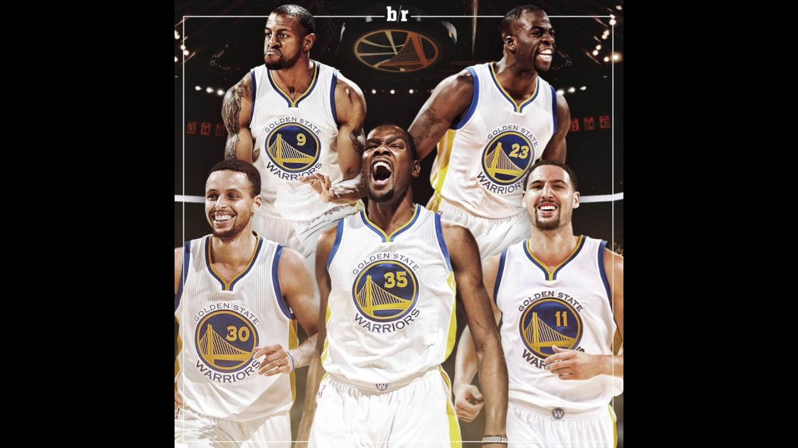
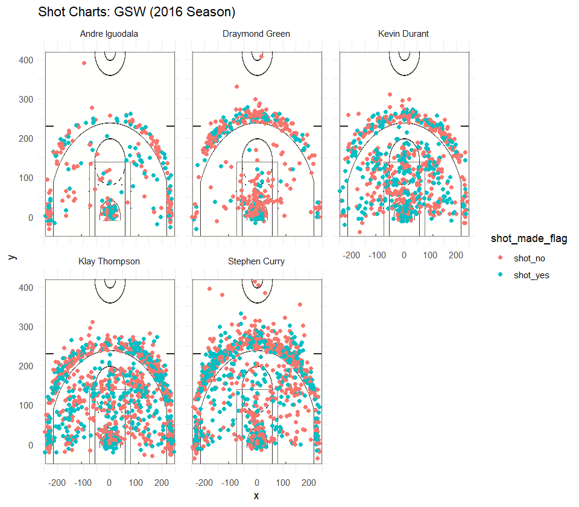

```{r setup, include=FALSE}
knitr::opts_chunk$set(echo = TRUE)
```

## Introduction

The Golden State Warriors have established themselves as arguably the best team in the NBA. A lot of that is attributed to their three core stares, Stephen Curry, Klay Thompson, and Kevin Durant. Stephen Curry and Klay Thompson, in particular, are known as the "Splash Brothers". Many opposing teams in the league focus their defense a lot on pressuring Curry to challenge his incredibly long range. However, Curry obviously can't score all the points, and thus an analysis of the shooting of the five Golden State Warrior starters can highlight the key locations where certain players take and make the most shots, as well as how accurate the starters are from different ranges on the basketball court. The purpose of this analysis is to explore the shooting patterns and percentages of the Golden State Warrior starters, and to create visualizations of their shooting locations. 

```{r out.width='80%',echo=FALSE,fig.align='center'}

```

##Motivation

The motivation of this analysis is to provide a detailed description of the shooting locations and accuracies of the Golden State Warrior starters. It is incredibly useful to analyze the core statistics of the Golden State Warrior starter shooting, such as their shooting percentages from 2-point range, shooting percentage from 3-point range, and overall shooting percentage. This is useful to see, since even if it seems like a player makes a good amount of threes, if their shooting percentage is low, it means their efficiency from three point range is not very productive. Thus, other teams might choose to not pressure that player as much from three if he has a lower three point percentage, since if you pressure someone really far out, you spread your defense out too much. Then, another motivation is for some more visualizations and some more detailed analysis. Thus, we included charts for each of the Golden State Warrior starters to elucidate the places where they shot from. This is helpful for us since even if we know the percentages, we don't really know where the shots are coming from, since a 2-point field goal is any shot from within the 3-point arc. So, if we include these shot charts, we can analyze more closely where in the entire ranges the players are shooting from, but also analyze and observe if there are locations where certain players like shooting from and are more accurate from, and places where they are not. 

##Background
All of our analysis is performed in R. The tables we will include show the shooting percentages for 2-point field goals, 3-point field goals, and total field goals for each of the Golden State Warrior starters in 2016. All of the data we have collected is from the 2016 season, and this data stays relevant since each of the players in our analysis are still currently on the team today. Some more background on our visualization: Each players shot chart is overlayed on a basketball court image. Each dot represents the relative location on the court where the player took the shot. 

##Data and Analysis
The first piece of data we will present are the tables detailing the various shooting percentages of the 5 Golden State Warriors players. Here is first the code I used to generate the tables. 
```{r,include=FALSE}
library(dplyr)
```

```{r}
gsw_shot_data <- read.csv("../data/shots-data.csv", stringsAsFactors = FALSE)
two_pt_data <- gsw_shot_data[gsw_shot_data$shot_type == "2PT Field Goal",]
three_pt_data <- gsw_shot_data[gsw_shot_data$shot_type == "3PT Field Goal",]

grouped_2pt_data <- group_by(two_pt_data, name)
twopt_effective <- arrange(summarise(grouped_2pt_data, total = n(), made = sum(shot_made_flag == "shot_yes"), percentage = made/total),desc(percentage))

grouped_3pt_data <- group_by(three_pt_data, name)
threept_effective <- arrange(summarise(grouped_3pt_data, total = n(), made = sum(shot_made_flag == "shot_yes"), percentage=made/total),desc(percentage))

grouped_shot_data <- group_by(gsw_shot_data, name)
total_effective <- arrange(summarise(grouped_shot_data, total = n(), made = sum(shot_made_flag == "shot_yes"), percentage =made/total),desc(percentage))
```
## Shooting Percentage Tables

###2-Point Field Goal Effective Shooting Percentages
```{r, echo=FALSE}
knitr::kable(twopt_effective)
```

###3-Point Field Goal Effective Shooting Percentages
```{r, echo=FALSE}
knitr::kable(threept_effective)
```

###Total Field Goal Effective Shooting Percentages
```{r, echo=FALSE}
knitr::kable(total_effective)
```

####Analysis On the Tables
Something to notice immediately is that the amount of shots Stephen Curry, Kevin Durant, and Klay Thompson take is significantly more than the other two players. This is why we must look at percentages to identify effectiveness and efficiency, since even though those 3 score the most amount of points, their shooting percentages are not all above the other 2 players. In terms of 2-point field goal effectiveness, Andre Iguodala has the highest field goal percentage. However, he has the second lowest 3-point percentage. Looking at his percentages, other teams could take advantage of the fact that his accuracy from 3 is not really a threat. This would pose somewhat of a problem, since Andre Iguodala is a small forward, and in the NBA, small forwards these days are starting to really be a threat from 3-point range and space out the defense. However, if Iguodala is only effective from 2-point range, teams can pack the paint and thus make it harder for the rest of his team to score 2-point field goals. However, to be fair, his 3-point percentage is only relatively lower than his teammates, but his teammates are extremeley proficient 3-point shooters. 

Looking at Draymond Green's stats, it is clear that he is the least effective player in this lineup, being 5th in 2-point, 3-point, and overall shooting percentage. In terms of scoring potential, Green and Iguodala play generally the same position, but Iguodala is clearly more effective. We also see that Iguodala takes significantly less shots than Green, so the GSW could potentially involve Iguodala in more plays to see if his percentages can hold up.

Overall, Steph Curry and Klay Thompson take the most shots on their team, and unlike the other three players, their number of 3-point field goal attempts and 2-point field goal attempts are actually almost the same. Thus, by being effective shooting from both ranges, they effectively spread out the defense. Their other teammates take significantly more 2-point field goals than 3-point field goals, which is actually the norm among basketball players in the NBA. Steph and Klay are called the "Splash Brothers" for a reason. Since they take much more 3 pointers than anyone on their team, their overall shooting percentage might be slightly misleading. Since 3 pointers are objectively harder than 2 pointers, their percentages have the potential to be higher if they adjusted the ratio of their 3 point to 2 point field goal attempts. It is also clear to see that Klay and Steph are the most effective 3-point shooters, with Klay having a slightly higher shooting average. Analyzing deeper, this small difference could be attributed to their playstyles. Steph Curry is the point guard and a playmaker, and a lot of 3 pointers he takes are from shots he created for himself, which makes it harder since he needs to create his own space and those shots are usually heavily contested. However, Klay is not as skilled in that aspect, and many times plays are called for him where screens are set and he catch-and-shoots open threes. This could be a factor in their difference in shooting percentages. It is also interesting to note, that relative to his teammates, Klay has the highest percentage for 3-point field goals, but the second lowest for 2-point field goals.

With regards to Kevin Durant, he is second in effectiveness in 2-point field goals, and third in 3-point field goals. He also takes the third most amount of shots on his team. Looking at his overall scoring effectiveness, he is the most effective, which makes sense based on his performance throughout the season.


##Shot Chart Visualizations
Below are the 5 shot charts for each of the 5 players. Each dot represents a spot where a player took a shot.

```{r out.width='80%',echo=FALSE,fig.align='center'}

```

###Analysis of Shot Charts
From these player shot charts, it is immediately apparent that Steph, Klay, and Durant take the most shots on the team. Also, you can also see generally that Klay and Steph do not have huge differences in 3-point and 2-point field goal attempts, which supports our analysis from the table section above. Also, Steph has the most shots from a much larger range, as seen by a good amount of shots made from around 40-feet. It is also a general trend that a lot of the players make more shots than they miss under the basket, which makes sense since you are much closer to the hoop. Also, Durant, Steph, and Klay cover the widest area with the shots that they take. They take shots from almost everywhere in the 2-point field goal range. Contrast that with Draymond, you see that he either takes 3-point field goals, or takes shots around the basket, and doesn't take many mid range jump shots. We can also see from the shot charts, that Iguodala has a little more area difference in the location of shots that he takes than Draymond, but that he also takes significantly less than anyone else in the starting 5, which was also supported by our table analysis. Another trend we can see, is that Steph generally makes more 2 point field goals on the left side of the court as opposed to the right side, whereas Durant and Klay's 2-point field goal accuracy is generally homogenous throughout the entire 2-point field goal area. Also, we can see that most of Draymond's 3-point field goals are around the center of the 3-point line, whereas Steph and Klay take threes from all around the 3-point line. However, Steph does make make more shots around the center of the 3-point line to the wing.


##Conclusion
In conclusion, we can clearly take away that Steph, Klay, and Durant take the most shots of the five players, while Iguodala takes by far the least. We also know that Steph and Klay do not take many more 2-point field goals than 3-point field goals, and they are the most effective 3-point shooters, but not as relatively effective from 2-point range. Also, Draymond is statistically the least effective shooter of the five players. With regards to shot charts and locations of shooting, Draymond and Iguodala take much more generally 'discrete' locations of the their shots, i.e either at the 3-point line or around the basket. Steph, Klay, and Durant, however, take shots from nearly every location in the 2-point range and 3-point line, and since they are generally effective shooters, this probably contributes to why they score so many points for the Golden State Warriors.

##Take Home Message
The Golden State Warriors 5 players main shotmakers are Steph, Klay, and Durant, and Steph and Klay are the primary 3-point shooters. Andre Iguodala is actually relatively very effective even though he doesn't take as many shots, and Draymond is not that effective of a shooter relatively.

##References
1.https://www.google.com/search?q=golden+state+warriors+2016+picture&source=lnms&tbm=isch&sa=X&ved=0ahUKEwjG2cXQhIHhAhUSvJ4KHcRqBfsQ_AUIDygC&biw=1522&bih=706#imgdii=JOvyga_txYS9AM:&imgrc=vxq6rBx7bv52MM:

2.https://bleacherreport.com/articles/2749739-5-wild-stats-defining-golden-state-warriors-season

3.https://www.nba.com/article/2017/12/14/one-team-one-stat-warriors-shooting-better-ever

